## Q-Learning on Taxi-v3
This repository contains a Q-Learning implementation for the Taxi-v3 environment, plus experiment outputs (plots and CSV metrics) and a short technical write-up.
## 1. Environment understanding
- Observation space: Discrete(500)
- Action space: Discrete(6)
- Actions: 0 South, 1 North, 2 East, 3 West, 4 Pickup, 5 Dropoff
- Rewards: -1 per step, +20 successful dropoff, -10 illegal pickup or dropoff
Taxi-v3 encodes each state as an integer in [0, 499] that represents taxi position, passenger location (including 'in taxi'), and destination.
## 2. Algorithm summary
Tabular Q-Learning updates the action-value table using:

$$
Q(s,a) = Q(s,a) + \alpha \left( r + \gamma \max_{a'} Q(s',a') - Q(s,a) \right)
$$

Training uses epsilon-greedy exploration; evaluation uses a greedy policy (epsilon = 0).
## 3. Experiments
All runs used gamma = 0.9, episodes = 10,000 per configuration, seed = 42.

Configurations:
- Baseline: alpha=0.1, epsilon=0.1
- Alpha sweep: alpha in {0.01, 0.001, 0.2} with epsilon=0.1
- Epsilon sweep: epsilon in {0.2, 0.3} with alpha=0.1

Key metrics are saved to `outputs/qlearning_results.csv`.
### 3.1 Results table (from qlearning_results.csv)
| alpha | epsilon | train_avg_return | train_avg_steps | eval_avg_return | eval_avg_steps | eval_success_rate |
|---:|---:|---:|---:|---:|---:|---:|
| 0.1 | 0.1 | -9.68 | 22.63 | 7.98 | 13.02 | 100.0% |
| 0.01 | 0.1 | -93.78 | 82.14 | -104.44 | 113.99 | 45.5% |
| 0.001 | 0.1 | -247.04 | 180.11 | -307.82 | 200.00 | 0.0% |
| 0.2 | 0.1 | -4.40 | 19.05 | 7.98 | 13.02 | 100.0% |
| 0.1 | 0.2 | -18.98 | 24.97 | 7.98 | 13.02 | 100.0% |
| 0.1 | 0.3 | -31.31 | 27.96 | 7.98 | 13.02 | 100.0% |
| 0.1 | 0.1 | -9.68 | 22.63 | 7.98 | 13.02 | 100.0% |

Notes:
- Training metrics are measured under epsilon-greedy behavior, so larger epsilon typically lowers training return even if the final greedy policy is optimal.
- Evaluation uses greedy action selection, so it reflects the quality of the learned Q-table.
## 4. Plot interpretation
All plots are saved under `outputs/plots/`.
### 4.1 Baseline (alpha=0.1, epsilon=0.1)
The baseline converges to a strong greedy policy: eval_return=7.98, eval_steps=13.02, success=100%. In the return curve, you should see an early transition from low returns (random behavior, frequent penalties) to higher returns once the agent reliably learns the pickup and dropoff sequence. In the steps curve, the moving average drops as the agent learns shorter paths and avoids illegal actions.


*Baseline return per episode*

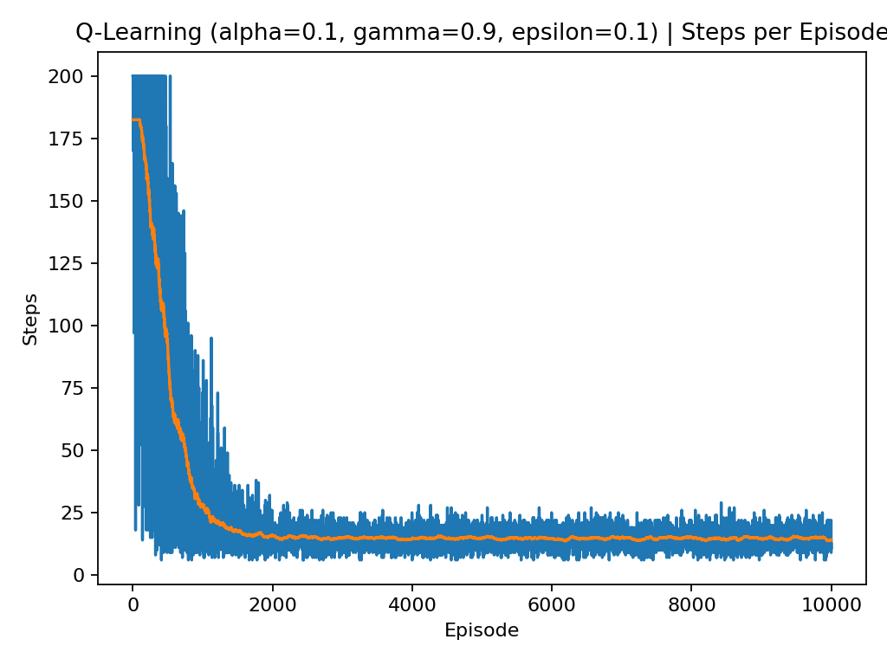
*Baseline steps per episode*

### 4.2 Alpha sweep (epsilon=0.1)
Alpha controls how quickly Q-values change in response to new experience.

- **alpha=0.2** learns at least as fast as baseline on this environment and reaches the same final greedy performance. You typically see a quicker improvement early in training because updates are larger.
- **alpha=0.01** learns but is much slower under a 10,000 episode budget. Returns improve gradually, steps decline more slowly, and evaluation remains weak (45.5% success).
- **alpha=0.001** is too small here. Updates are tiny, so the Q-table stays near its initialization and the curves remain flat, with evaluation failing (0% success and the 200-step cap).

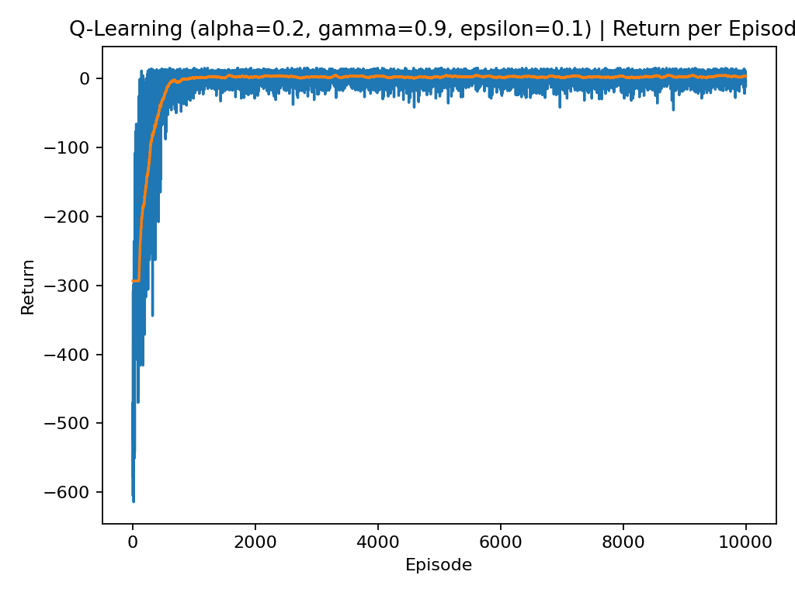
*Alpha=0.2 return per episode*

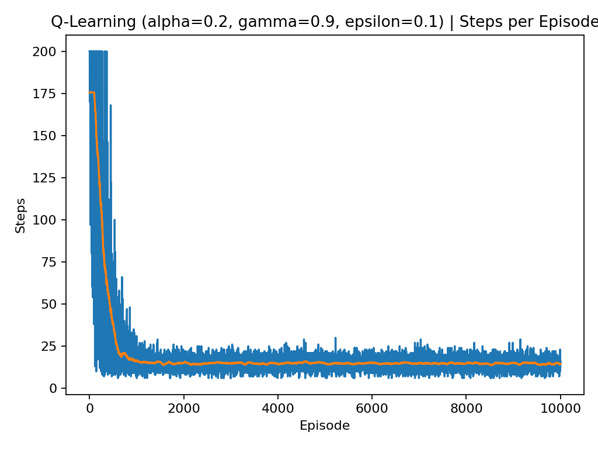
*Alpha=0.2 steps per episode*

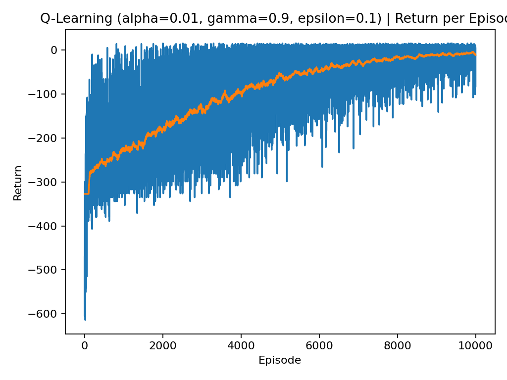
*Alpha=0.01 return per episode*

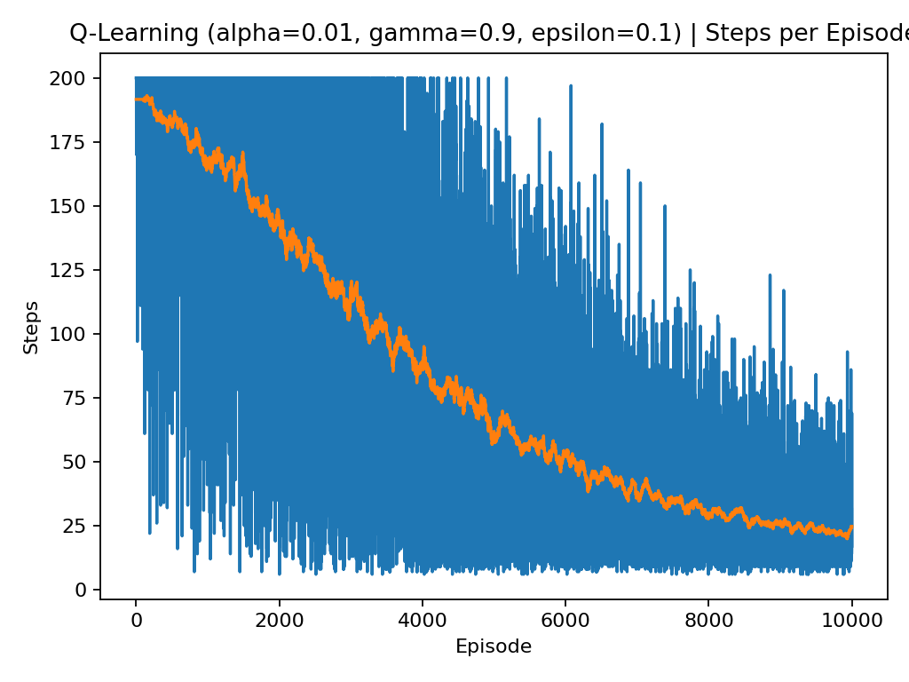
*Alpha=0.01 steps per episode*


*Alpha=0.001 return per episode*

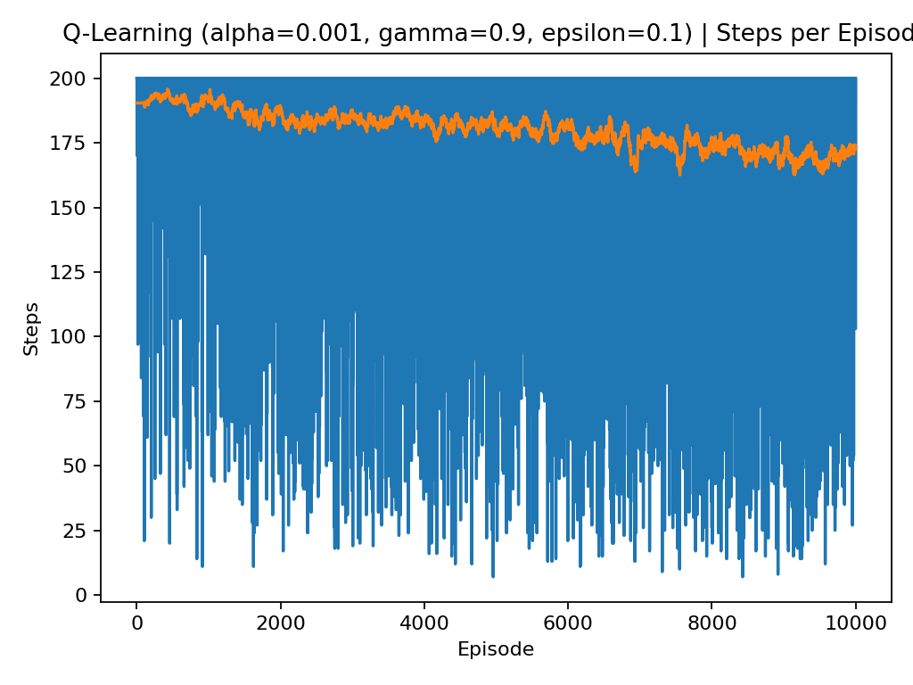
*Alpha=0.001 steps per episode*

### 4.3 Epsilon sweep (alpha=0.1)
Epsilon controls exploration during training.

- With **epsilon=0.2** and **epsilon=0.3**, the agent takes more random actions during training, which typically lowers training returns and increases training steps. This shows up as noisier curves and lower moving averages.
- Despite worse-looking training curves, evaluation is identical to baseline (100% success, 13.02 steps). This happens because evaluation is greedy (epsilon=0), so it measures the learned policy rather than the exploratory behavior.

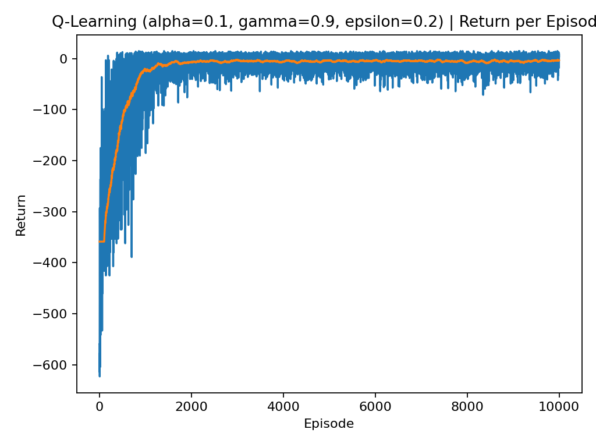
*Epsilon=0.2 return per episode*

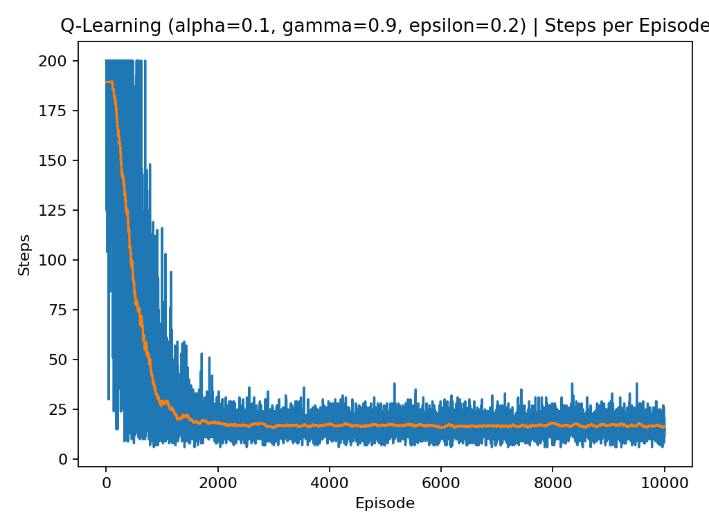
*Epsilon=0.2 steps per episode*

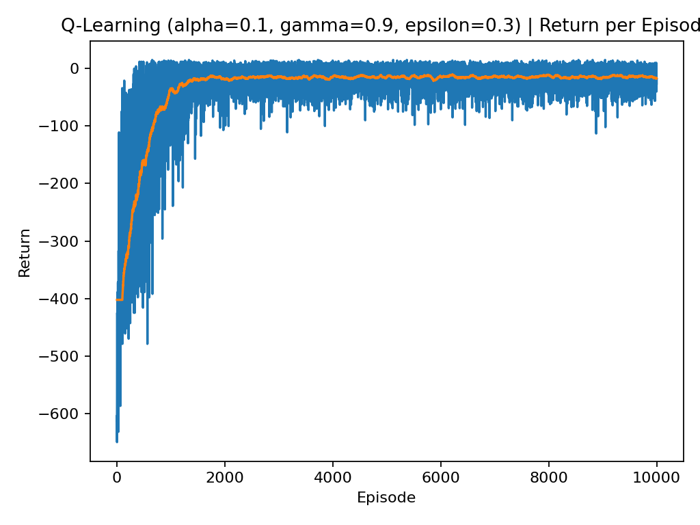
*Epsilon=0.3 return per episode*

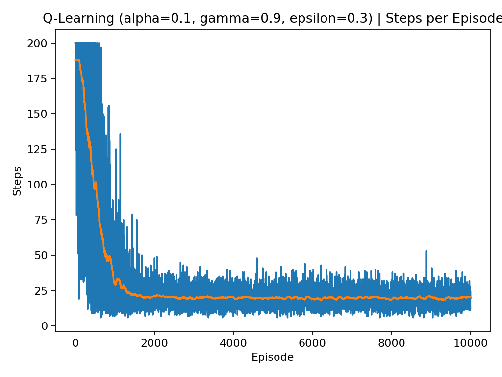
*Epsilon=0.3 steps per episode*

### 4.4 Best combination rerun
The selection criterion was best evaluation return (tie-breaker: fewer evaluation steps). Several configurations reached the same best evaluation performance, so the rerun primarily demonstrates reproducibility and stable convergence.

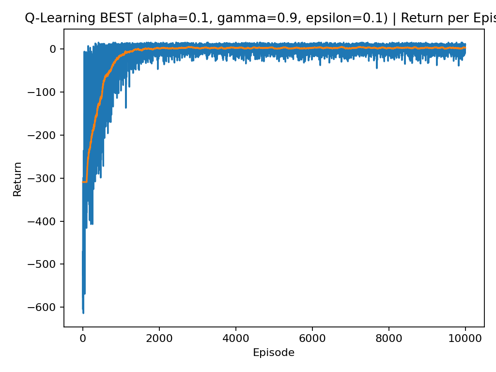
*Best rerun return per episode*


*Best rerun steps per episode*

## 5. What is happening behind the scenes
1) **Q-table meaning**: each entry Q(s,a) estimates expected discounted return from taking action a in state s.
2) **Bootstrapping**: the target uses $\max_{a'} Q(s', a')$, so learning uses current estimates to improve future estimates.
3) **Alpha effect**: very small alpha can prevent learning within a fixed training budget; larger alpha accelerates learning but can be unstable in harder tasks.
4) **Epsilon effect**: higher epsilon reduces training performance by design, but can help discover good trajectories early.
5) **Training vs evaluation**: training curves reflect exploratory behavior; evaluation isolates the greedy policy quality.

## 6. How to reproduce
Run:

```bash
python main.py --run all
```

Outputs:
- `outputs/qlearning_results.csv`
- `outputs/plots/*.png`
- `outputs/qtable_best.npy` and `outputs/qtable_best_meta.json` (best rerun)
